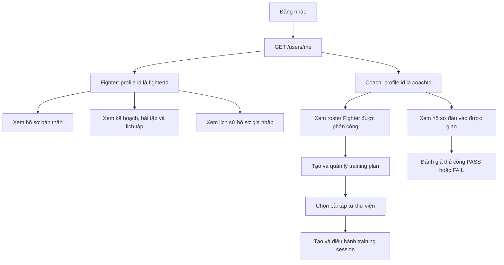
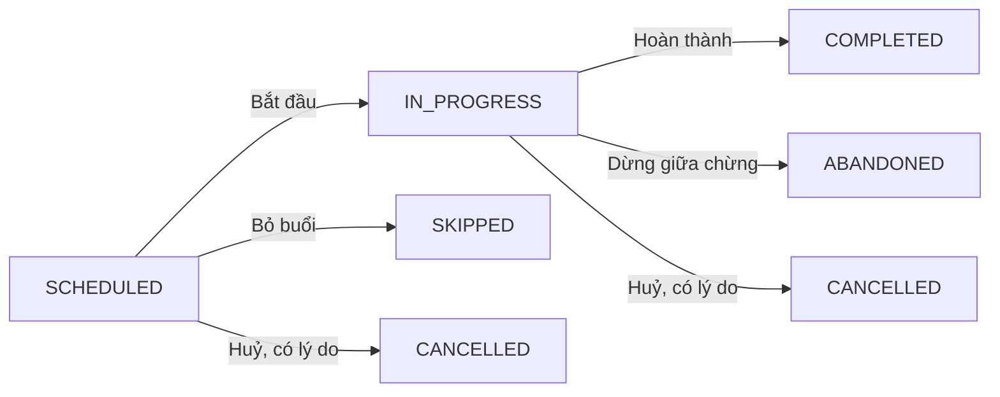
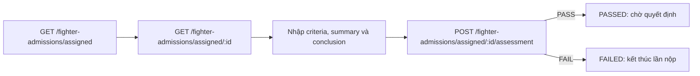

# Fighter & Coach — các luồng hiện có cho Frontend

> Snapshot source ngày 25/09/2026, gồm cả thay đổi chưa commit trong workspace. Đây là hành vi đọc từ backend, chưa xác nhận deployment/migration trên server và chưa chạy API/test. Phạm vi: Fighter, Coach; bỏ qua Medical, màn hình Admin và AI. Guest chỉ xuất hiện để giải thích đường trở thành Fighter.

## 1. FE cần biết trước khi nối API

- **Base URL là origin của NestJS**: dùng `/auth/login`, `/users/me`, `/training-plans`… `main.ts` hiện **không** gọi `setGlobalPrefix('api/v1')`. Nếu môi trường có proxy thêm prefix, cấu hình riêng theo môi trường. Swagger ở `/docs` và `/api-docs`.
- Gửi `Authorization: Bearer <accessToken>` cho các route bảo vệ. Request dùng camelCase; UUID là ID profile/domain, không thay bằng ID tài khoản.
- Sau login, gọi `GET /users/me`: `data.id` là **userId**, `data.profile.id` là **fighterId hoặc coachId** theo `data.role`. Login chỉ trả user cơ bản và session, không trả profile.
- Quyền truy cập = permission đang có **và** scope tài nguyên. Role một mình không bảo đảm HTTP 200; explicit user deny thắng role grant. Login và `/users/me` hiện không trả danh sách effective permissions.
- Quyền mặc định trong tài liệu suy ra từ SQL: Fighter có 7 quyền **đọc Training** trong migration 008; Coach có quyền đánh giá hồ sơ trong 009 và **21 quyền** trong 010 sau revert, không có `fighter.medical:read`. Chưa xác minh các migration đã chạy trên database đích.

**Envelope thực tế:**

```json
{ "success": true, "message": "...", "data": { "id": "..." } }
```

| Loại kết quả | Đường dẫn sau khi parse JSON response |
| --- | --- |
| Một đối tượng | `body.data` |
| List Fighters / Coach roster / Training / Exercises | `body.data.data` là array; `body.data.total`, `body.data.hasNextPage` |
| List hồ sơ admission | `body.data.items` là array; `body.data.total`, `body.data.page`, `body.data.limit` |
| List bài tập của plan / lịch sử Coach assignment | `body.data` là array |
| Lỗi | `body.error.statusCode`, `body.error.code`, `body.error.message`, `body.error.details?` |

Hai cấp `data` ở collection là kết quả hiện tại của service pagination cộng global envelope; FE cần adapter theo endpoint. Pagination thông thường: `page=1`, `limit=20`, tối đa `100`. Query/body strict sẽ từ chối field ngoài schema; gửi PATCH chỉ với các field cần sửa, không gửi nguyên response object.

Nguồn: [bootstrap](../nestjs-api/src/main.ts), [Auth contracts](../nestjs-api/src/auth/auth.model.ts), [Users controller](../nestjs-api/src/users/users.controller.ts), [profile projection](../nestjs-api/src/users/users.repo.ts), [envelope](../nestjs-api/src/shared/interceptors/api-response.interceptor.ts), [guard](../nestjs-api/src/shared/guards/auth.guard.ts), [008](../nestjs-api/migrations/008_grant_training_read_permissions_to_fighter.sql), [010](../nestjs-api/migrations/010_grant_coach_permissions.sql).

## 2. Bản đồ các flow



Sơ đồ trên mô tả điều hướng FE đề xuất từ các API đã có, không khẳng định các màn hình FE đã được xây dựng. Session có thể tạo độc lập, không bắt buộc phải có plan. Có [bản diagram chỉnh sửa bằng diagrams.net](diagrams/fighter-coach-flows.drawio).

## 3. Flow chung — đăng nhập, khôi phục và nạp lại danh tính

1. `POST /auth/login` với `{ email, password }` → 200, nhận `data.user` và `data.session` (`accessToken`, `refreshToken`, `expiresAt`, `expiresIn`, `tokenType`).
2. `GET /users/me` → lấy role và profile ID; điều hướng vào Fighter hoặc Coach. Tài khoản GUEST chưa có Fighter profile.
3. Khi phiên hết hạn, `POST /auth/refresh` với `{ refreshToken }` → thay **cả hai token** bằng session mới. FE nên gom các lần refresh đồng thời và không retry vô hạn nếu refresh thất bại.
4. `POST /auth/logout` có bearer → `{ loggedOut: true }`; FE xoá state phiên.
5. Quên mật khẩu: `POST /auth/forgot-password` với `{ email }`. Luôn hiện thông báo chung theo response, không kết luận tài khoản tồn tại hoặc email đã giao thành công.
6. Từ recovery link, đọc `token_hash`, gửi `POST /auth/reset-password` với `{ tokenHash, newPassword }`. Response là `{ passwordUpdated, admissionActivationReady }`, **không có session token mới**. Nếu cần activation thì bảo đảm có bearer hợp lệ; có thể đăng nhập lại bằng mật khẩu mới.

Nguồn: [Auth controller](../nestjs-api/src/auth/auth.controller.ts), [Auth service](../nestjs-api/src/auth/auth.service.ts).

## 4. Flow trở thành Fighter và xem lịch sử gia nhập

| Bước phía ứng viên | API / kết quả hiện tại |
| --- | --- |
| Đăng ký | `POST /auth/register { email, password }` → 201; tạo GUEST. Nếu `confirmationRequired=true`, làm xác nhận email theo provider; `session` có thể null. |
| Nộp hồ sơ | `POST /fighter-admissions/applications` → 201, chỉ GUEST. Bắt buộc `firstName`, `lastName`, `dateOfBirth`, `weightClass`; không gửi email/role trong body. |
| Theo dõi hồ sơ | `GET /fighter-admissions/applications/me` và `GET /fighter-admissions/applications/me/:id`. GUEST và FIGHTER đều đọc lịch sử của chính mình. |
| Chờ đánh giá/quyết định | Các trạng thái application: `SUBMITTED`, `PASSED`, `FAILED`, `APPROVED`, `REJECTED`, `ACTIVATED`. Các bước phân công/phê duyệt nằm ngoài tài liệu này. |
| Đặt mật khẩu qua recovery | Gọi `/auth/reset-password`; nếu hồ sơ đã được duyệt, thành công sẽ cho phép bước activation. |
| Kích hoạt | `POST /fighter-admissions/activation` có bearer, không cần body → 200; trả `applicationId`, `status`, `role: FIGHTER`, `alreadyActive`. Gọi lại sau hoàn tất là idempotent. |
| Vào Fighter | Gọi lại `/users/me` để lấy role và Fighter profile mới; không tiếp tục dùng profile null cache từ GUEST. |

Một tài khoản chỉ có một application đang mở; `FAILED`/`REJECTED` cho phép nộp lần mới khi vẫn là GUEST. `PASSED` **chưa** cấp quyền Fighter. Không phải Fighter nào cũng có admission history: tài khoản được tạo qua đường tuyển trực tiếp có thể có danh sách rỗng.

Activation tạo Fighter profile nhưng source của `activate()` không tự tạo `coach_fighters`; không coi Coach đánh giá đầu vào là Coach phụ trách luyện tập sau activation.

Nguồn: [admission controller](../nestjs-api/src/fighter-admissions/fighter-admissions.controller.ts), [service](../nestjs-api/src/fighter-admissions/fighter-admissions.service.ts), [schema](../nestjs-api/src/fighter-admissions/fighter-admissions.model.ts), [statuses](../nestjs-api/src/fighter-admissions/fighter-admissions.constants.ts).

## 5. Fighter — xem hồ sơ và lịch luyện tập

Luồng cơ bản: `/users/me` → lịch tập → chi tiết session → kế hoạch liên quan → danh sách bài tập → chi tiết bài tập.

| Màn hình / thao tác | API và điểm cần dùng |
| --- | --- |
| Hồ sơ cá nhân | `GET /users/me` không cần permission riêng. Đây là đường đọc hồ sơ mặc định. |
| Danh sách kế hoạch | `GET /training-plans?page=1&limit=20`; backend tự scope Fighter về chính mình. Có filter `status`, `isActive`. |
| Chi tiết kế hoạch | `GET /training-plans/:id`; có `progress: { totalSessions, completedSessions, completionPercentage }`. |
| Bài tập của kế hoạch | `GET /training-plans/:id/exercises`; lấy `exerciseId` để đọc `/exercises/:exerciseId`. |
| Lịch sử / lịch tập | `GET /training-sessions`; lọc `planId`, `status`, `sessionType`, `fromDate`, `toDate`; ngày lọc dựa trên `scheduledAt`. |
| Chi tiết buổi tập | `GET /training-sessions/:id`; hiển thị lịch, loại buổi tập, ghi chú, trạng thái, thời gian thực tế nếu có. |
| Thư viện bài tập | `GET /exercises`, `GET /exercises/:id`; có filter `category`, `targetMuscle`, `search`. |

**Fighter mặc định chỉ đọc Training** theo migration 008: không dựng nút check-in, hoàn thành buổi tập, đổi trạng thái, nhập RPE hoặc chỉnh plan như quyền mặc định. Các API ghi có tồn tại nhưng cần grant riêng; không suy quyền ghi từ việc đọc được session.

`GET /fighters/:id`, `/fighters/:id/coaches`, `/fighters/:id/sessions` và `PATCH /fighters/:id` cần permission `fighter:*` tương ứng. Migrations đang đọc không cấp baseline những quyền này cho FIGHTER; FE không nên phụ thuộc chúng để mở màn hình cá nhân mặc định. Việc self-scope trong service không tự cấp quyền qua guard.

Nguồn: [Training access](../nestjs-api/src/training/training-access.service.ts), [plan service](../nestjs-api/src/training/plans/training-plan.service.ts), [session service](../nestjs-api/src/training/sessions/training-session.service.ts), [Training contracts](../nestjs-api/src/training/training.model.ts), [Fighters controller](../nestjs-api/src/fighters/fighters.controller.ts).

## 6. Coach — roster và Fighter đang phụ trách

1. `GET /users/me` → lấy `coachId = data.profile.id`.
2. `GET /coaches/:coachId/fighters?page=1&limit=20` → roster hiện tại. Coach chỉ dùng Coach ID của chính mình; không có assignment thì 200 với list rỗng.
3. Chọn một Fighter → `GET /fighters/:fighterId` (cùng contract `PublicFighterDto`, không có projection riêng cho Coach).
4. Mở tab lịch sử phân công: `GET /fighters/:fighterId/coaches`. Mở lịch sử tập: `GET /fighters/:fighterId/sessions`.
5. Mở các plan/session thuộc phạm vi được phép và tạo mới qua flow bên dưới.

Sau revert, `/fighters`, `/fighters/:id` và `/coaches/:id/fighters` dùng `PublicFighterDto`: thông tin định danh/profile, `dateOfBirth`, `heightCm`, `reachCm`, số đo tay/chân, `currentMedicalStatus`, `bio`, `isActive`, timestamps… Xem schema trong nguồn bên dưới để lấy contract đầy đủ. Filter roster hiện hỗ trợ `weightClass`, `dominantStance`, `gym`, **`medicalStatus`**, `search`. Không dùng lại contract `CoachFighterSummary` đã bị gỡ.

Coach hiện còn đọc được `GET /fighters/:fighterId/measurements` trong assignment scope, qua quyền `fighter.measurement:read`; không có quyền ghi số đo mặc định. Đây là hành vi **hiện tại**, chưa đáp ứng chính sách Medical tương lai ở §11. FE chưa xây Medical UI cho Fighter/Coach và không coi các field sức khỏe đang xuất hiện là quyền truy cập lâu dài.

Scope được kiểm tra bằng assignment hiệu lực: `startsAt <= now` và (`endsAt=null` hoặc `endsAt > now`), với profile hoạt động. Assignment đã hết hạn hoặc chưa bắt đầu không cấp quyền. Khi quyền bị thu hồi trong lúc đang mở màn hình, FE xử lý 403 và xoá dữ liệu stale khỏi view đó.

**Điểm dễ bỏ sót:** `GET /training-plans?fighterId=...` và `GET /training-sessions?fighterId=...` khi gọi bởi Coach còn tự lọc `coachId` về Coach hiện tại. Vì vậy list chỉ chứa record mang Coach ID đó, không phải toàn bộ record do các Coach khác tạo cho cùng Fighter. Muốn xem lịch sử buổi tập tổng quát của Fighter được assign, dùng `/fighters/:id/sessions`. Session tạo thiếu `coachId` sẽ lưu null và không xuất hiện trong danh sách session của Coach này.

Nguồn: [Coaches service](../nestjs-api/src/coaches/coaches.service.ts), [roster schema](../nestjs-api/src/coaches/coaches.model.ts), [Fighters service](../nestjs-api/src/fighters/fighters.service.ts), [projection](../nestjs-api/src/fighters/fighters.model.ts), [Training list queries](../nestjs-api/src/training/training.repo.ts).

## 7. Coach — lập kế hoạch và cấu hình bài tập

| Thứ tự | API / payload |
| --- | --- |
| 1. Chọn Fighter trong roster | Giữ `fighterId`, `coachId` của profile hiện tại. |
| 2. Tạo plan | `POST /training-plans` → 201. Bắt buộc `{ fighterId, coachId, title, startDate }`; tuỳ chọn `description`, `endDate`, `goals`, `milestones`. `startDate/endDate` là `YYYY-MM-DD`. |
| 3. Chọn bài từ thư viện | `GET /exercises`, rồi `GET /exercises/:id` nếu cần chi tiết. Coach mặc định chỉ đọc thư viện. |
| 4. Gắn bài vào plan | `POST /training-plans/:id/exercises` → 201. Bắt buộc `{ exerciseId, orderIndex }`; tuỳ chọn `sets`, `reps`, `durationSeconds`, `targetRpe`, `coachNotes`. |
| 5. Sửa / bỏ bài khỏi plan | `PATCH` hoặc `DELETE /training-plans/:id/exercises/:exerciseId`. **Path `:exerciseId` ở đây là ID của record plan-exercise**, không phải ID bài trong thư viện. DELETE trả 200 với `{ id }`. |
| 6. Sửa plan | `PATCH /training-plans/:id`; gửi field được phép như `title`, `goals`, `milestones`, `startDate`, `endDate`. Không đổi `fighterId/coachId` qua PATCH. |
| 7. Đổi trạng thái plan | `PATCH /training-plans/:id/status { status }`; enum `DRAFT`, `ACTIVE`, `COMPLETED`, `CANCELLED`. |

Plan mới mặc định `DRAFT`. Code hiện chỉ cấm `COMPLETED → DRAFT` và `CANCELLED → DRAFT`, **không** enforce một chuỗi tuyến tính DRAFT → ACTIVE → COMPLETED. Không mô tả chuỗi đó là state machine đầy đủ. Milestone hoàn tất cần `completedAt`; milestone chưa hoàn tất không gửi `completedAt`.

Tạo plan và gắn bài **không tự tạo session**. Tạo session trong flow tiếp theo. Tiến độ plan tính từ số session `COMPLETED` / tổng session gắn plan, làm tròn phần trăm; không có session thì bằng 0. Sửa milestones không tự hoàn tất plan.

Nguồn: [plan controller](../nestjs-api/src/training/plans/training-plan.controller.ts), [plan service](../nestjs-api/src/training/plans/training-plan.service.ts), [Training schemas](../nestjs-api/src/training/training.model.ts), [repository](../nestjs-api/src/training/training.repo.ts), [transition rules](../nestjs-api/src/training/training.constants.ts).

## 8. Coach — tạo và điều hành buổi tập

`POST /training-sessions` → 201. Bắt buộc `fighterId`, `title`, `scheduledAt` (ISO timestamp có timezone), `sessionType`; truyền `coachId` hiện tại để session xuất hiện trong list Coach. `planId` là tuỳ chọn; nếu có phải trỏ tới plan còn tồn tại, `isActive=true` và cùng Fighter. `isActive` khác với `status=ACTIVE`.

Các field tuỳ chọn khác: `plannedDurationSec`, `roundCount`, `location`, `coachNotes`. `roundCount` mặc định 0. Session mới là `SCHEDULED`.



- Đổi trạng thái: `PATCH /training-sessions/:id/status { status }`. Nếu `CANCELLED`, bắt buộc thêm `cancellationReason`; trạng thái khác không được gửi field này.
- Gửi lại cùng status trả session hiện tại. Các trạng thái kết thúc không chuyển sang trạng thái khác; chuyển sai trả 400, xung đột cập nhật trả 409.
- Backend tự ghi mốc thời gian và `actualDurationSec` khi buổi tập đã bắt đầu rồi kết thúc. FE không gửi `actualDurationSec`, `checkedInAt`, `completedAt` trong PATCH.
- `PATCH /training-sessions/:id` để sửa lịch, tiêu đề, ghi chú hoặc `reportedRpe` (số nguyên 1–10); status và cancellationReason dùng route riêng ở trên.
- Sau mutation, FE nên refetch session và plan detail/progress liên quan. Session không có plan thì chỉ refetch session/list.

Các `sessionType` được chấp nhận: `SHADOW_BOXING`, `PAD_WORK`, `HEAVY_BAG`, `SPARRING`, `GRAPPLING`, `STRENGTH_CONDITIONING`, `RECOVERY`, `PHYSICAL_THERAPY`. Danh sách enum được giữ nguyên contract, tài liệu không mô tả workflow Medical.

Nguồn: [session controller](../nestjs-api/src/training/sessions/training-session.controller.ts), [session service](../nestjs-api/src/training/sessions/training-session.service.ts), [status map](../nestjs-api/src/training/training.constants.ts), [request schemas](../nestjs-api/src/training/training.model.ts).

## 9. Coach — đánh giá đầu vào thủ công



List/detail chỉ dành cho hồ sơ có **assignment đánh giá đang mở** của Coach; đây là assignment admission, không dùng `coach_fighters`. List nhận `page/limit`, không có status filter. UI có thể dựa trên status và assessment của từng row để hiển thị hành động.

Payload assessment: `{ conclusion: "PASS" | "FAIL", summary, criteria }`, với 1–30 criteria. Mỗi criterion cần `criterionName`, `method`, `observation`; `value`, `unit`, `note` là tuỳ chọn. API trả 201 với staff view mới. Gửi đánh giá chỉ hợp lệ khi application còn `SUBMITTED` và Coach vẫn được giao; assessment đã nộp không có API sửa/xoá. PASS không tự kích hoạt Fighter.

Nguồn: [admission controller](../nestjs-api/src/fighter-admissions/fighter-admissions.controller.ts), [submitAssessment](../nestjs-api/src/fighter-admissions/fighter-admissions.service.ts), [assessment schema](../nestjs-api/src/fighter-admissions/fighter-admissions.model.ts).

## 10. Quyền, lỗi và các giới hạn FE cần xử lý

| Nhóm thao tác | Fighter baseline | Coach baseline |
| --- | --- | --- |
| `/users/me`, logout | Authenticated | Authenticated |
| Đọc Training Plan/Session/Plan Exercise/Exercise | Có, self-scope | Có, assignment scope; library đọc chung |
| Tạo/sửa plan, cấu hình bài trong plan, tạo/sửa/chuyển trạng thái session | Chưa cấp | Có theo 010 |
| Tạo/sửa bài trong thư viện | Chưa cấp | Chưa cấp |
| Roster và Fighter detail qua `/fighters` | Chưa cấp | Có theo 010, chỉ Fighter đang phụ trách |
| Lịch sử Coach assignment, Fighter session history | Chưa cấp | Có theo 010, assignment scope |
| Đọc measurements | Chưa cấp mặc định | Có theo 010, assignment scope; sẽ cần đổi khi triển khai §11 |
| Medical summary | Chưa cấp mặc định | 010 không cấp `fighter.medical:read` |
| Sửa profile, tự assign/end Coach | Không coi là quyền mặc định | Không coi là quyền mặc định |
| Lịch sử admission của bản thân | Có, role-gated | Không dùng route applicant |
| Đánh giá admission được giao | Không | Có theo 009 |

Baseline không phải danh sách quyền của mọi tài khoản thật. Override theo user/role và trạng thái migration đích có thể thay đổi kết quả.

| HTTP | FE xử lý |
| --- | --- |
| 401 | Xử lý phiên hết hạn/đăng nhập lại; không refresh lặp khi chính login/recovery token không hợp lệ. |
| 403 | Không đủ permission hoặc ngoài scope; không mặc định logout. |
| 404 | Resource không tồn tại/không còn khả dụng; quay lại danh sách phù hợp. |
| 400 | Lệnh nghiệp vụ không hợp lệ, ví dụ chuyển trạng thái session sai. Hiển thị `error.code/message`. |
| 409 | Conflict trạng thái/cập nhật đồng thời, hồ sơ đang mở hoặc assessment đã nộp; refetch trước thao tác tiếp. |
| 422 | Validation; map `error.details` về field. |
| 429 | Bị giới hạn tần suất, chờ rồi thử lại. |
| 5xx | Hiển thị lỗi và cho thử lại phù hợp; không suy ra mutation thất bại tuyệt đối rồi tự gửi lặp mọi POST. |

Các flow trên có code backend và module registration; không đồng nghĩa mọi màn hình, seed dữ liệu hay quyền trên server đã sẵn sàng. Source chưa cung cấp flow thông báo realtime cho các thao tác này; hướng tích hợp đơn giản là refetch sau mutation và khi quay lại view. Những đề xuất xử lý state/refetch trong tài liệu là hướng dẫn FE, không phải hành vi tự động của backend.

Không mở rộng các flow hiện tại sang AI, Medical hoặc các màn hình vận hành Admin. Các source chính để đối chiếu khi backend thay đổi: [AppModule](../nestjs-api/src/app.module.ts), [Auth](../nestjs-api/src/auth/auth.controller.ts), [Fighters](../nestjs-api/src/fighters/fighters.controller.ts), [Coaches](../nestjs-api/src/coaches/coaches.controller.ts), [Training model](../nestjs-api/src/training/training.model.ts), [Admissions](../nestjs-api/src/fighter-admissions/fighter-admissions.controller.ts).

## 11. Chính sách Medical mới — đã duyệt, chưa triển khai

Quyết định ngày **25/09/2026**, nguồn chuẩn: [Master Specification §05.10.1](MMA-TMS-MASTER-SPECIFICATION-v3.md). Đây là mục tiêu cho feature tương lai, không phải mô tả quyền đang được backend thực thi.

| Vai trò | Đọc medical và measurements | Ghi/cập nhật medical và measurements |
| --- | --- | --- |
| DOCTOR đang được assign hiệu lực cho Fighter | Có, kèm permission tương ứng | Có, kèm permission; số đo sửa bằng bản ghi thay thế |
| DOCTOR không được assign / assignment hết hạn hoặc chưa bắt đầu | Không | Không |
| FIGHTER, kể cả chính mình | Không theo chính sách mới | Không |
| COACH, kể cả Fighter đang phụ trách | Không theo chính sách mới | Không |
| ADMIN | Không theo quy tắc chỉ assigned Doctor | Không; không có ngoại lệ Admin |

FE cần giữ flow Training/roster tách khỏi Medical. Khi triển khai Medical sau này, đồng bộ contract backend trước khi bỏ/đổi tab measurements, field sức khỏe và filter `medicalStatus`; không chỉ ẩn trên UI. Rà soát cả `/users/me`, Fighter list/detail/roster và các đường đọc/ghi profile để không lộ hoặc sửa dữ liệu medical gián tiếp. Không tự thêm ngoại lệ Fighter self-read, Coach assigned-read hoặc Admin read-all từ yêu cầu cũ.

**Khoảng cách hiện tại:** `medical-summary` vẫn là code legacy (service chỉ kiểm tra self-scope cho FIGHTER; chưa scope DOCTOR theo assignment và chưa có medical-read audit). Permission guard vẫn áp dụng, và 010 không cấp Coach quyền này; việc không cấp trong 010 không thu hồi grant/override đã có trên database. Coach measurements và `PublicFighterDto` vẫn như §6. Chỉ có thể công bố tuân thủ chính sách mới sau khi backend, RLS/grants, projections, FE và tests được cập nhật, kiểm chứng cùng nhau; đợt tài liệu này không thực hiện các thay đổi đó.
